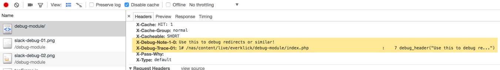
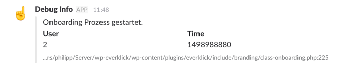
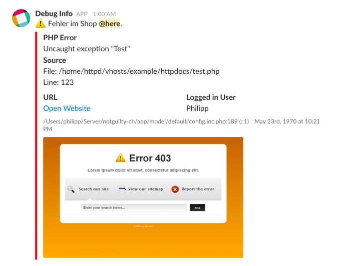

# Debug Module

Version 2.5.2

A simple and lightweight debug module that can be used on any PHP project.

## Installation

### WordPress

1. Clone this repo to ABSPATH folder - that's the folder where wp-config.php is located.
2. Create the file `wp-content/mu-plugins/debug.php` with the contents below. If the "mu-plugins" folder does not exist, create it

```php
<?php require_once ABSPATH . '/wp-debug/debug.php';
```


### Non WordPress

1. Clone this repo to your website.
1. Add a `require_once "debug.php";` line before using the module

Require the debug.php file as early as possible.

-----

## Live Demo

1. Clone this repo to your web server root folder.
2. Open the file `https://localhost/docs` to see some more samples and real output.

-----

## Usage

### Different debugging methods

**On screen:**

* `debug( $val1, $val2, ... )`
* `debug_and_die( $val1, $val2, ... )`
* `debug_marker( $val )`
* `debug_show()`
* `debug_hooks()`

**As return value:**

* `debug_get_marker( $val )`

**To logfile:**

* `debug_log( $val1, $val2, ... )`
* `debug_log_trace()`

**In HTTP response headers:**

* `debug_header( $messages )`

**Send to Slack:**

* `log_slack( $message, $channel, $trace_lines, $is_private )`  
  `debug_slack()` is an alias for `log_slack()`

-----

### Load the debugging module

```php
require 'debug.php';

// Check if debugging is active via the return value of the include:
$is_active = require 'debug.php';
```

### Flags to customize the behavior

```php
// Dynamically change flags during runime.
debug_flag( $name, $value )
```

List of flags:

- `enabled`  
  (boolean)  
  If set to true or false it will override the EVR_DEBUG value.
  If set to null the `EVR_DEBUG` value is used.

- `format`  
  (html | text)  
  Toggles the plain-text / HTML output of the debug.
  All Ajax requests will ignore this flag and use plain-text format.

- `sort`  
  (boolean)  
  Toggles the alphabetical sorting of array/object keys in the dump.  
  See `define( 'EVR_DEBUG_SORT', ... );`

- `mark_fields`  
  (array / comma separated string)  
  Defines, which array/object fields are highlighted as "primary key"
  fields in the debug dump.  
  See `define( 'EVR_DEBUG_MARK_FIELDS', ... );`

- `show_trace`  
  (boolean)  
  If set to true each debug output will contain a stack-trace.
  Otherwise, only the variable will be dumped. Default: true.  
  See `define( 'EVR_DEBUG_TRACE', ... );`

- `show_request`  
  (boolean)  
  Whether to show request details (like GET/POST/COOKIE values) at the
  end of every debug dump. Default: true.

- `show_stats`  
  (boolean)  
  Whether to show request stats like memory usage and php version at
  the end of every debug dump. Default: true.

- `stop_redirect`  
  (boolean)  
  WordPress specific flag. Whether to prevent wp_redirect from
  redirecting users. If set to true, a link with the target URL is
  displayed instead of automatic redirection.  
  See `define( 'EVR_STOP_REDIRECT', ... );`

### Constants to customize the module

```php
// Disable this module.
define( 'EVR_DEBUG', false );
```

```php
// Log all messages, including notices and deprecation details.
//
// When not defined, or set to true, the error_reporting is configured
// to exclude notices/deprecation/strict details.
// WHen set to false, error_reporting is not changed.
define( 'EVR_DEBUG_LOG_IMPORTANT', false );
```

```php
// Enable debugging, when a cookie with name 'debugging' is found.
// This overrules EVR_DEBUG.
define( 'EVR_DEBUG_WITH_COOKIE', 'debugging' );
```

```php
// Enable debugging for the specified IP address.
// This overrules EVR_DEBUG and EVR_DEBUG_WITH_COOKIE.
define( 'EVR_DEBUG_WITH_IP', 'debugging' );
```

```php
// Do not append back-trace to debug(), debug_and_die() and debug_header()
define( 'EVR_DEBUG_TRACE', false );
```

```php
// Do not sort array/object keys alphabetically but show the original order.
define( 'EVR_DEBUG_SORT', false );
```

```php
// Highlight fields with the key "pkey" or "order_id" in array/object dumps.
define( 'EVR_DEBUG_MARK_FIELDS', 'pkey,order_id' );
```

```php
// Set the hook for the log_slack() function
define( 'EVR_SLACK_HOOK', '123456789' ); // REQUIRED for log_slack()
define( 'EVR_SLACK_NAME', 'Debug Bot' );
define( 'EVR_SLACK_ICON', ':wink:' );
define( 'EVR_SLACK_CHANNEL', '#general,@username' );
```

```php
// Customize the output dir of the logfile.
// Default dir is same dir as this file is in.
define( 'EVR_LOG_DIR', '/etc/log' );
```

```php
// Customize the filename of the logfile (only the file, not whole path!)
// Default name is: "debug-info.log"
define( 'EVR_LOG_FILE', 'my-logfile.txt' );
```

```php
// Disable output of JS debugging functions.
define( 'EVR_DEBUG_JS', false );
```

### Special WordPress debugging features

All WordPress redirects include a back-trace in the HTTP response headers.

```php
// Instead of redirecting display a back-trace and the target URL on the screen.
define( 'EVR_STOP_REDIRECT', true );
```

```php
// No Debug output in admin-ajax.php responses.
define( 'EVR_AJAX_DEBUG', false );
```

```php
// Enable the debug module without enabling WP_DEBUG.
define( 'EVR_DEBUG', true );
```

```php
// The "No-Conflict" mode allows you to modify the `debug` function name:
define( 'EVR_NOCONFLICT_DEBUG', '_debug' ); // debug() is now _debug()
define( 'EVR_NOCONFLICT_DEBUG', '§' ); // debug() is now §()  .. U+00A7
```

#### Installation for WordPress

-----

## Screenshots

*Log to HTTP response headers*\


*Log to Slack*\


*Log to Slack*\

